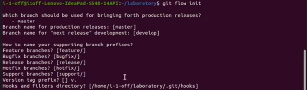
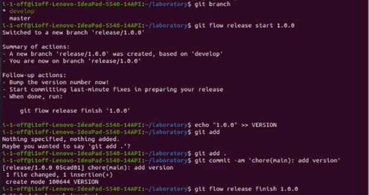

---
# Front matter
lang: ru-RU
title: "Отчет по второй лабораторной работе"

author: "Иванов Никита Владимирович"

# Formatting
toc-title: "Содержание"
toc: true # Table of contents
toc_depth: 2
lof: true # List of figures
lot: true # List of tables
fontsize: 12pt
linestretch: 1.5
papersize: a4paper
documentclass: scrreprt
polyglossia-lang: russian
polyglossia-otherlangs: english
mainfont: PT Serif
romanfont: PT Serif
sansfont: PT Sans
monofont: PT Mono
mainfontoptions: Ligatures=TeX
romanfontoptions: Ligatures=TeX
sansfontoptions: Ligatures=TeX,Scale=MatchLowercase
monofontoptions: Scale=MatchLowercase
indent: true
pdf-engine: lualatex
header-includes:
  - \linepenalty=10 # the penalty added to the badness of each line within a paragraph (no associated penalty node) Increasing the value makes tex try to have fewer lines in the paragraph.
  - \interlinepenalty=0 # value of the penalty (node) added after each line of a paragraph.
  - \hyphenpenalty=50 # the penalty for line breaking at an automatically inserted hyphen
  - \exhyphenpenalty=50 # the penalty for line breaking at an explicit hyphen
  - \binoppenalty=700 # the penalty for breaking a line at a binary operator
  - \relpenalty=500 # the penalty for breaking a line at a relation
  - \clubpenalty=150 # extra penalty for breaking after first line of a paragraph
  - \widowpenalty=150 # extra penalty for breaking before last line of a paragraph
  - \displaywidowpenalty=50 # extra penalty for breaking before last line before a display math
  - \brokenpenalty=100 # extra penalty for page breaking after a hyphenated line
  - \predisplaypenalty=10000 # penalty for breaking before a display
  - \postdisplaypenalty=0 # penalty for breaking after a display
  - \floatingpenalty = 20000 # penalty for splitting an insertion (can only be split footnote in standard LaTeX)
  - \raggedbottom # or \flushbottom
  - \usepackage{float} # keep figures where there are in the text
  - \floatplacement{figure}{H} # keep figures where there are in the text
---

# Цель работы

Изучить идеологию и применение средств контроля версий.

# Задание

1. Настройка git.
2. Подключение локального репозитория к Github.
3. Настройка первичной конфигурации.
4. Настройка конфигурации git-flow.

# Выполнение лабораторной работы

## Настройка git.

{width=70% }
{width=70% }
{width=70% }
Создал аккаунт на github.

## Подключение локального репозитория к github.

{width=70% }
{width=70% }
Создал рабочий каталог laboratory и репозиторий OSLAB. Добавил файл README.md
и к нему добавил commit “first commit” после чего отправил на гитхаб.

## Настройка первичной конфигурации.

{width=70% }
{width=70% }
Добавил файл лицензии.

## Настройка конфигурация git-flow

{width=70% }
{width=70% }
{width=70% }

Инициализировал git flow.
Проверил что нахожусь на ветке develop.
Создал релиз версии 1.0.0 и записал туда релиз.
Добавил релизную ветку в основную и отправил данные на гитхаб.

# Выводы

В ходе данной работы изучил идеологию и применение средств контроля версий.

# Контрольные вопросы:

1. Системы контроля версий предназначаются для систематизации процесса поддержки и обновления программного обеспечения, своевременного выхода обновлений и исправления в нём критических ошибок.
2. Хранилище – сервер, удалённое место хранения и обмена рабочих файлов
 2. Коммит – текстовое сопровождение изменений, загружаемых в хранилище. Служит для фиксации внесённых изменений, говорит о проделанной работе.
 2. История – последовательность версий разрабатываемой программы/продукта, сохраняется в ветку master.
 2. Рабочая копия – файл, загружаемый из удалённого репозитория на локальный для проведения над ним работ, внесения изменений.
3. Централизованные VCS – существует единственный центральный репозиторий, из которого берутся рабочие копии(subversion, CVS). Децентрализованные VCS – каждая подключённая рабочая машина может выступать в роли полноценного хранилища (git, mercurial).
4. Разработал программу, «запушил» все изменения в хранилище, доработал программу, «запушил» все изменения в хранилище.
5. Распределили роли в команде, скопировал нужную мне рабочую копию, доработал её, «запушил» изменения в хранилище, «слил» свою часть работы с работой всей команды, заново скопировал рабочую версию.
6. Контроль версий, возможность совместной системной работы над продуктом, выгрузка и загрузка данных в хранилище, сливание веток разработки.
7. git <действие>
8. Локальный репозиторий – рабочее пространство программиста, в котором он выполняет свою работу, например, пока совершает трансатлантический перелёт, во время которого нет доступа к удалённому репозиторию. Удалённый репозиторий – место обмена и слияния рабочих файлов, куда, например, наш программист загрузит результат длительной работы в самолёте.
9. Ветви – логическое разделение направлений разработки. Отдельная история разработки фичей, отдельная история багафиксов, и отдельная история готовых релизов. Ветви позволяют структурировать процесс разработки и не потеряться в гигабайтах исходников.
10. Хорошим тоном считается игнорирование бинарных (скомпилированных) файлов в разработки, так как они не несут никакой пользы для программистов. Реализуется посредством записи определённых расширений в файл .gitignore
